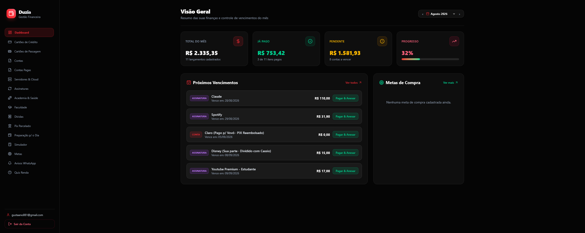

<p align="center">
  
  
  
  
  
</p>

<h1 align="center">💰 Duzia</h1>

<p align="center">
  Plataforma de controle financeiro pessoal — backend NestJS + frontend Next.js em monorepo.
</p>

<p align="center">
  
  
  
</p>

---

## 📋 Índice

- [Sobre](#-sobre)
- [Funcionalidades](#-funcionalidades)
- [Tecnologias](#-tecnologias)
- [Como rodar](#-como-rodar)
- [Estrutura do projeto](#-estrutura-do-projeto)
- [Deploy](#-deploy)
- [Autor](#-autor)

---

## 💡 Sobre

Duzia é uma plataforma pessoal de controle financeiro que centraliza receitas, despesas e relatórios em um só lugar. Construída como projeto de estudo e uso pessoal, com foco em boas práticas de arquitetura backend e stack moderna no frontend.

---

## 📸 Preview



---

## ✨ Funcionalidades

- 🔐 Autenticação com JWT + refresh token
- 💸 Cadastro de receitas e despesas por categoria
- 📊 Relatórios mensais: saldo, total por categoria e evolução diária
- ⚠️ Alertas de limite de gasto por categoria
- 🗑️ Soft delete em transações
- 📄 Documentação automática com Swagger (`/api/docs`)
- 🚀 Deploy automático via GitHub Actions

---

## 🛠️ Tecnologias

| Camada | Tecnologia |
|---|---|
| Backend | NestJS 11 + TypeScript |
| ORM | TypeORM |
| Banco de dados | PostgreSQL (Supabase) |
| Frontend | Next.js (App Router) + React 19 |
| Containerização | Docker + Docker Compose |
| CI/CD | GitHub Actions |

---

## 🚀 Como rodar

### Pré-requisitos

- Node.js 20+
- Docker e Docker Compose

### Instalação

```bash
# Clone o repositório
git clone https://github.com/devGustavoR/duzia.git
cd duzia
```

### Backend

```bash
cd back-end
npm install
cp .env.example .env
# Configure as variáveis de ambiente
npm run dev
```

### Frontend

```bash
cd front-end
npm install
cp .env.example .env.local
npm run dev
```

### Rodando com Docker

```bash
docker compose up -d
```

Acesse:
- Frontend: `http://localhost:3000`
- Backend/Swagger: `http://localhost:3001/api/docs`

---

## 📁 Estrutura do projeto

```
duzia/
├── back-end/          # API NestJS — porta 3001
│   ├── src/
│   │   ├── auth/
│   │   ├── categories/
│   │   ├── transactions/
│   │   ├── reports/
│   │   └── common/
│   └── Dockerfile
├── front-end/         # Next.js App Router — porta 3000
│   ├── app/
│   ├── components/
│   └── Dockerfile
├── .github/workflows/ # CI/CD GitHub Actions
└── docker-compose.yml
```

---

## 📦 Deploy

Deploy automático via GitHub Actions em push para `main`:
- Build das imagens Docker
- `docker compose up -d` na VPS via SSH

---

## 👨‍💻 Autor

Feito por **Gustavo Ribeiro**

[](https://linkedin.com/in/devgustavor)
[](https://devgustavor.com.br)
[](https://github.com/devGustavoR)
